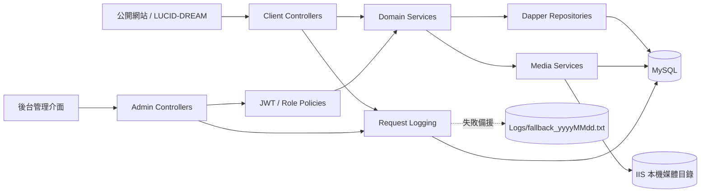

# ToBeClarify API 開發說明

> 文件日期：2026-08-25<br>
> 程式碼基準：`main` / `982c957`<br>
> 正式 API：<https://api.marchgroup.net><br>
> Swagger UI：<https://api.marchgroup.net/swagger/index.html><br>
> Client Swagger：<https://api.marchgroup.net/swagger/client/swagger.json><br>
> Admin Swagger：<https://api.marchgroup.net/swagger/admin/swagger.json>

## 1. 文件目的與資訊優先順序

本文件整理目前 `ToBeClarify-api` 已存在的架構、端點、資料模型、權限、媒體處理與部署流程，供前後端分工、功能設計與程式碼審查使用。

遇到描述不一致時，請依以下順序判斷：

1. 目前 `main` 分支程式碼。
2. 執行中環境產生的 Swagger。
3. 本文件。
4. `skill/雞排店(暫定)-DB設計.xlsx` 舊版資料庫設計稿。

Excel 設計稿仍可用來理解原始領域規劃，但目前已和程式碼出現多處差異，不能直接視為正式資料庫規格。`db/migrations` 已從店員點餐排程欄位開始作為增量 schema source of truth；既有資料表尚未回補為完整 baseline，仍需逐步補齊。

## 2. 系統概覽

API 採 ASP.NET Core Web API，公開網站與後台共用同一服務，但以 URL 前綴及權限分流：

- 公開端：`/api/client/*`
- 後台端：`/api/admin/*`
- API 文件：`/swagger`
- 公開媒體：`/api/client/media/{id}?variant=...`

主要技術：

| 項目 | 現況 |
| --- | --- |
| Runtime | .NET 10 / ASP.NET Core |
| 資料存取 | Dapper 2.1.66 |
| 資料庫 | MySQL，相容驅動 MySqlConnector 2.6.1 |
| 驗證 | JWT Bearer，同時支援 HttpOnly Cookie |
| 密碼 | PBKDF2-HMAC-SHA256，600,000 次迭代 |
| 圖片處理 | ImageSharp 3.1.12 |
| API 文件 | Swagger / OpenAPI，分成 Client 與 Admin 文件 |
| 部署 | GitHub Actions → self-hosted Windows runner → IIS |

### 2.1 邏輯架構



### 2.2 請求處理順序

`Program.cs` 目前的主要 middleware 順序：

1. `ExceptionHandlingMiddleware`：統一轉換錯誤格式。
2. `RequestInterceptorMiddleware`：記錄路徑、IP、狀態碼、耗時、使用者與例外。
3. Rate Limiter：限制留言、登入與註冊頻率。
4. CORS。
5. Swagger（Development 或 `EnableSwagger=true`）。
6. Authentication。
7. Authorization。
8. Controllers。

所有 MySQL 連線開啟後都會執行 `SET time_zone = '+08:00'`。應用程式時鐘也固定使用 UTC+8。

## 3. 專案目錄

```text
ToBeClarify-api/
├─ Program.cs                         啟動、DI、JWT、CORS、限流、Swagger
├─ appsettings*.json                  非機密預設設定
├─ web.config                         IIS in-process hosting
├─ .github/workflows/deploy.yml       CI/CD
├─ scripts/deploy-iis.ps1             IIS 部署、健康檢查與回復
├─ docs/                              協作文件
├─ db/migrations/                     需由 DBA / 部署流程依序套用的增量 SQL
├─ skill/                             舊版 DB 設計與 mock data
└─ src/
   ├─ Auth/                           JWT、角色、Cookie、密碼雜湊
   ├─ Controllers/
   │  ├─ Client/                      公開端 API
   │  └─ Admin/                       後台 API
   ├─ Exceptions/                     業務、404、401、403 例外
   ├─ Infrastructure/                 DB context、台灣時區 clock
   ├─ Middlewares/                    錯誤處理、請求紀錄
   ├─ Models/
   │  ├─ Common/                      統一 API response
   │  ├─ Dtos/                        輸入與輸出 contract
   │  ├─ Entities/                    Dapper query row models
   │  └─ Media/                       媒體設定
   ├─ Repositories/                   SQL 與交易控制
   └─ Services/                       業務規則、mapping、媒體與 logging
```

一般功能的呼叫方向為 `Controller → Service → Repository → MySQL`。Controller 不應直接寫 SQL，Repository 不應處理 HTTP 或角色權限。

## 4. 本機開發

### 4.1 必要條件

- .NET 10 SDK。
- 可連線的 MySQL 資料庫。
- API 執行帳號對媒體目錄與 `Logs` 目錄有寫入權限。
- 必須先準備相容資料表；目前專案不會自動執行 migration，部署 API 前需先依序套用 `db/migrations`。

### 4.2 本機機密設定

`Program.cs` 會在一般 `appsettings.json` 之後載入 `appsettings.Local.json`。該檔案已被 Git 忽略，適合放本機連線字串與 JWT signing key；環境變數會在最後重新套用，因此 CI/CD 或一次性本機覆寫仍具有最高優先序。

範例：

```json
{
  "ConnectionStrings": {
    "DefaultConnection": "Server=127.0.0.1;Port=3306;Database=...;User ID=...;Password=...;"
  },
  "JwtAuth": {
    "Issuer": "ToBeClarify.Api",
    "Audience": "ToBeClarify.Admin",
    "SigningKey": "請使用至少 32 字元的隨機機密"
  },
  "AdminAuth": {
    "CrossSiteCookie": false,
    "TokenLifetimeMinutes": 120
  },
  "Cors": {
    "AllowedOrigins": [
      "http://localhost:4173",
      "http://localhost:5173"
    ]
  },
  "Media": {
    "RootPath": "media",
    "PublicBaseUrl": "http://localhost:5000",
    "RoutePrefix": "/api/client/media"
  },
  "EnableSwagger": true
}
```

也可用 ASP.NET Core 環境變數覆寫，例如：

```text
ConnectionStrings__DefaultConnection
JwtAuth__SigningKey
AdminAuth__CrossSiteCookie
Media__RootPath
Media__PublicBaseUrl
Cors__AllowedOrigins__0
```

禁止將正式連線字串、JWT signing key、註冊驗證碼或帳號密碼提交到 Git。

### 4.3 啟動與檢查

```powershell
dotnet restore .\ToBeClarify.Api.csproj
dotnet run --project .\ToBeClarify.Api.csproj
```

Development 環境或 `EnableSwagger=true` 時，可由 `/swagger` 開啟 Swagger UI。正式環境可使用 <https://api.marchgroup.net/swagger/index.html>，並提供分開的 Client 與 Admin Swagger JSON。

最低限度提交前檢查：

```powershell
dotnet build .\ToBeClarify.Api.csproj --configuration Release
dotnet publish .\ToBeClarify.Api.csproj --configuration Release --no-build --output publish
```

## 5. API 共通約定

### 5.1 回應格式

一般 JSON 端點使用統一 envelope，ASP.NET Core 預設輸出 camelCase：

成功：

```json
{
  "success": true,
  "data": {}
}
```

失敗：

```json
{
  "success": false,
  "errorCode": "STAFF_NOT_FOUND",
  "message": "Staff member not found.",
  "traceId": "..."
}
```

媒體端點是例外：它直接回傳檔案串流，不包 `ApiResponse<T>`。

### 5.2 HTTP 狀態與錯誤

| 類型 | HTTP | 說明 |
| --- | ---: | --- |
| Model validation | 400 | `VALIDATION_ERROR` |
| `BusinessException` | 400 | 使用功能專屬 error code |
| `UnauthorizedException` | 401 | 對外訊息固定為 `Unauthorized` |
| `ForbiddenException` | 403 | 角色或資料範圍不允許 |
| `NotFoundException` | 404 | 資料不存在或不可公開 |
| Rate limit | 429 | `RATE_LIMITED` |
| 未處理例外 | 500 | `SERVER_ERROR`，不回傳內部例外內容 |

前端應以 HTTP status 加 `errorCode` 判斷，不應依賴英文或中文 `message` 做流程控制。

### 5.3 日期、排序與識別碼

- 主要識別碼為 UUID 字串，資料庫欄位通常使用 `VARCHAR(40)`。
- 日期輸出以 `DateTimeOffset` 為主，服務 mapping 為 UTC+8。
- `sortOrder` 數字越小越前面。
- 公開 repository 會過濾 `isActive`、`isEnabled`、`isAvailable` 或 `isPublished`。
- 資料庫設計刻意不使用 FK，跨表一致性及硬刪除由 service/repository 維護。

## 6. 驗證、Cookie 與角色

### 6.1 登入狀態

登入成功後，API 會寫入 HttpOnly Cookie：

```text
tbc_admin_access_token
```

API 同時接受 `Authorization: Bearer {token}`。目前 login response 只回傳身分資料，不直接回傳 token，因此瀏覽器後台主要使用 Cookie。

Cookie 特性：

- `HttpOnly=true`
- Path：`/api`
- 預設 lifetime：120 分鐘
- `CrossSiteCookie=true` 時使用 `SameSite=None` 並要求 Secure
- 跨網域呼叫需在 CORS 白名單內，前端 fetch 需設定 `credentials: "include"`

### 6.2 角色與權限

| 角色值 | 顯示名稱 | 目前能力 |
| --- | --- | --- |
| `developer` | 開發者 | 所有後台內容、店員、媒體及註冊碼功能 |
| `manager` | 經理 | 與 developer 相同的內容管理能力，可簽發店員註冊碼 |
| `clerk` | 店員 | 可讀後台店員資料；只能修改自己綁定的店員資料與狀態；上傳類別限 `staff`、`gallery` |

主要 authorization policy：

- `AdminOnly`：developer、manager、clerk。
- `AdminManager`：developer、manager。
- `AdminDeveloper`：只有 developer，目前沒有 controller 端點直接使用。

### 6.3 店員註冊流程

1. developer 或 manager 呼叫 `POST /api/admin/auth/register-key`。
2. API 產生 32-byte 隨機 hex 驗證碼，預設 10 分鐘過期。
3. 新店員呼叫 `POST /api/admin/auth/register`，提交帳號、密碼與驗證碼。
4. 驗證碼成功消耗後，API 在同一 transaction 建立 `STAFF_MEMBERS` 與 `ADMIN_USERS`，角色固定為 `clerk`。
5. 驗證碼只能使用一次，儲存在伺服器檔案並以 process semaphore 加檔案鎖避免重複消耗。

`AdminAuthService.RegisterAsync` 雖支援 developer 建立任意角色帳號，但目前沒有 controller route 對外暴露。

### 6.4 限流

| Policy | 規則 |
| --- | --- |
| `guestbook-write` | 每個來源 IP 每分鐘 5 次 |
| `admin-login` | 每個來源 IP 每分鐘 10 次 |
| `admin-register` | 每個來源 IP 每分鐘 5 次 |

## 7. 公開 Client API

所有 Client API 目前皆不要求登入。

| Method | Path | 參數 / 功能 | 回傳重點 |
| --- | --- | --- | --- |
| GET | `/api/client/home` | 首頁組合資料 | site settings、navbar、輪播、slides、店內規則 |
| GET | `/api/client/home-event-carousels` | 首頁活動輪播 | 啟用輪播、相簿存在狀態、圖片 URL |
| GET | `/api/client/site-settings` | 所有啟用設定 | `settingKey`、任意 JSON `settingValue` |
| GET | `/api/client/site-settings/{settingKey}` | 單一設定 | 不存在回 404 |
| GET | `/api/client/navigation-items` | `placement=navbar|footer`，預設 navbar | 已組成父子階層的 navigation |
| GET | `/api/client/shop-rules` | 店內規則 | 啟用項目 |
| GET | `/api/client/pricing-rules` | 消費規則 | 標題、說明、`priceText` |
| GET | `/api/client/menu` | 完整菜單 | pricing rules、categories/items、sets/items |
| GET | `/api/client/menu/categories` | 菜單分類與其品項 | 啟用及供應中資料 |
| GET | `/api/client/menu/items/{id}` | 單一品項 | 不存在回 `MENU_ITEM_NOT_FOUND` |
| GET | `/api/client/menu/sets/{id}` | 單一套餐 | 不存在回 `MENU_SET_NOT_FOUND` |
| GET | `/api/client/staff-members` | `limit` 可省略，允許 1–100 | 公開店員卡片、服務、即時狀態 |
| GET | `/api/client/staff-members/{id}` | 店員詳細資料 | 簡介、相簿、一般與特殊服務 |
| GET | `/api/client/staff-members/{id}/services` | 店員服務 | 啟用服務 |
| GET | `/api/client/staff-reservations` | `from`、`to`；預設今日起 7 天，最多 31 天 | 預約區段與公開遊戲 ID `customerName` |
| GET | `/api/client/gallery-albums` | 公開相簿 | 已發布相簿 |
| GET | `/api/client/gallery-albums/{id}` | 相簿詳細資料 | 詳細段落與 items |
| GET | `/api/client/gallery-albums/{id}/items` | 相簿圖片 | 已發布 items |
| GET | `/api/client/guestbook/comments` | `page=1`、`pageSize=20`，pageSize 1–100 | 分頁留言與回覆 |
| POST | `/api/client/guestbook/comments` | `displayName`、`content`、選填 `userToken` | 建立公開留言；每 IP 每分鐘 5 次 |
| GET | `/api/client/guestbook/comments/{id}` | 單一可見留言 | 留言與回覆 |
| POST | `/api/client/guestbook/comments/{id}/replies` | `displayName`、`content`、選填 `userToken` | 建立公開回覆；每 IP 每分鐘 5 次 |
| GET | `/api/client/rankings` | `type=staffRanking|monetaryRanking`；`period` 選填 | 未給 period 時取字串最大期間 |
| GET | `/api/client/media/{id}` | `variant=original|thumbnail|card|hero|full` | 圖片串流、Range、ETag、24 小時 cache |

### 7.1 店員狀態計算

公開店員狀態不是直接讀 `STAFF_MEMBERS.CURRENT_STATUS`：

1. 今天 `STAFF_SCHEDULES.IS_WORKING=false` → `off` / `未上班`。
2. 否則當下存在 `active` 預約區段 → `busy` / `指名中`。
3. 其餘 → `available` / `待命中`。

如果今天沒有 schedule row，目前預設視為有上班。`todayShift` 現在固定回傳 `null`。

## 8. 後台 Admin API

除 login、register、logout 外，Admin API 需要有效 JWT Cookie 或 Bearer token。

### 8.1 認證端點

| Method | Path | 權限 | 功能 |
| --- | --- | --- | --- |
| POST | `/api/admin/auth/login` | Anonymous | 登入並寫入 HttpOnly Cookie |
| POST | `/api/admin/auth/register` | Anonymous + 一次性驗證碼 | 建立 clerk 帳號及對應 staff member |
| POST | `/api/admin/auth/register-key` | developer / manager | 簽發一次性註冊驗證碼 |
| GET | `/api/admin/auth/me` | 所有後台角色 | 重新由 DB 取得目前登入身分 |
| POST | `/api/admin/auth/logout` | Anonymous | 刪除瀏覽器 Cookie |

### 8.2 內容管理端點

下表標示「管理者」時，代表 developer 或 manager。

| 資源 | 端點 | 權限 | 現況 |
| --- | --- | --- | --- |
| Site settings | `GET /api/admin/site-settings` | 管理者 | 取得全部含未啟用資料 |
| Site settings | `PUT /api/admin/site-settings/{settingKey}` | 管理者 | 依 key upsert JSON 設定 |
| Navigation | `GET/POST /api/admin/navigation-items` | 管理者 | 列表 / 新增 |
| Navigation | `PUT/DELETE /api/admin/navigation-items/{id}` | 管理者 | 更新 / 刪除；刪父項會一併刪子項 |
| Home carousel | `GET/POST /api/admin/home-event-carousels` | 管理者 | 輪播必須參照存在的 gallery album |
| Home carousel | `PUT/DELETE /api/admin/home-event-carousels/{id}` | 管理者 | 更新 / 刪除 |
| Home slides | `GET/POST /api/admin/home-slides` | 管理者 | slide 必須有 `mediaId` |
| Home slides | `PUT/DELETE /api/admin/home-slides/{id}` | 管理者 | 更換或刪除後嘗試清理舊媒體 |
| Shop rules | `GET/POST /api/admin/shop-rules` | 管理者 | 列表 / 新增 |
| Shop rules | `PUT/DELETE /api/admin/shop-rules/{id}` | 管理者 | 更新 / 刪除 |
| Gallery | `GET/POST /api/admin/gallery-albums` | 管理者 | 相簿及 items 一次儲存 |
| Gallery | `PUT/DELETE /api/admin/gallery-albums/{id}` | 管理者 | 更新 / 硬刪 items、輪播參照與相簿 |
| Pricing rules | `GET/POST /api/admin/pricing-rules` | 管理者 | 列表 / 新增 |
| Pricing rules | `PUT/DELETE /api/admin/pricing-rules/{id}` | 管理者 | 更新 / 刪除 |
| Menu | `GET /api/admin/menu` | 管理者 | 完整後台菜單 |
| Menu category | `POST /api/admin/menu/categories` | 管理者 | 新增 |
| Menu category | `PUT/DELETE /api/admin/menu/categories/{id}` | 管理者 | 有品項時禁止刪除 |
| Menu item | `POST /api/admin/menu/items` | 管理者 | 新增 |
| Menu item | `PUT/DELETE /api/admin/menu/items/{id}` | 管理者 | 被套餐使用時禁止刪除 |
| Menu set | `POST /api/admin/menu/sets` | 管理者 | 新增套餐及 items |
| Menu set | `PUT/DELETE /api/admin/menu/sets/{id}` | 管理者 | 交易式覆寫 items / 刪除 |

### 8.3 店員管理

| Method | Path | 權限與範圍 |
| --- | --- | --- |
| GET | `/api/admin/staff-members` | 所有角色可讀完整列表 |
| GET | `/api/admin/staff-members/{id}` | 所有角色可讀任一店員完整資料 |
| PUT | `/api/admin/staff-members/{id}` | 管理者可編輯任一店員；clerk 只能編輯自己綁定的 id |
| PUT | `/api/admin/staff-members/{id}/status` | 同上，可更新 `isWorkingToday` 或 `isActive` |
| PUT | `/api/admin/staff-members/order` | 只有管理者可排序 |
| DELETE | `/api/admin/staff-members/{id}` | 只有管理者；硬刪服務、gallery、schedule 與 staff row |

目前沒有 `POST /api/admin/staff-members`。新店員是透過註冊流程建立，或需由資料庫 / 未來新增管理端點建立。

店員主資料新增以下排程欄位：

- `bufferMinutes`：選填，0–1440 分鐘；只在後台 API 回傳，不公開。
- `isNominatable`：必填布林，既有與新建立店員預設 `false`；公開 Client API 會回傳供店員卡片顯示「可以指名」。

店員服務正式 contract 包含：

- `serviceType`：`common` 或 `special`
- `serviceName`
- `serviceDescription`
- `priceText`：選填促銷／特殊價格文案；有值時公開前端優先顯示此文字，否則顯示 `price`
- `price`：選填、非負整數，單位 Gil
- `durationMinutes`：選填，0–1440 分鐘
- `isNominatable`：舊版相容欄位；目前指名資格統一由店員主資料的 `isNominatable` 控制，管理畫面不再提供服務層級開關
- `additionalPersonPrice`：選填、非負整數，單位 Gil／每位額外人數
- `sortOrder`
- `isEnabled`

`price` 仍是計算用的結構化數值；`priceText` 是非必填的顯示覆蓋值，適合「期間限定優惠」等無法只用數字表達的促銷文案。

### 8.4 媒體管理

| Method | Path | 權限 | 功能 |
| --- | --- | --- | --- |
| POST | `/api/admin/media/upload` | 所有後台角色 | multipart 上傳，單檔上限 10 MB |
| POST | `/api/admin/media/cleanup` | 所有後台角色 | 清理指定或過期且未被參照的媒體 |

支援 MIME type：JPEG、PNG、WebP、GIF。允許 category：`site`、`home`、`staff`、`event`、`menu`、`gallery`、`admin`；clerk 只可使用 `staff` 或 `gallery`。

上傳流程只驗證圖片與記錄原始尺寸，原始檔會保留。公開讀取非 original variant 時才以 ImageSharp 延遲產生 WebP：

| Variant | 最大尺寸 | 格式 / 品質 |
| --- | --- | --- |
| `thumbnail` | 480 × 480 | WebP 82 |
| `card` | 960 × 720 | WebP 82 |
| `hero` | 1600 × 1000 | WebP 82 |
| `full` | 2048 × 2048 | WebP 82 |

resize 使用 `ResizeMode.Max`，會維持比例，不會強制裁成指定長寬。

背景維護服務啟動 1 分鐘後執行，之後每小時：

- 將舊的 `category/yyyyMM/file` 路徑整理為 `category/file`。
- 清除建立超過 24 小時、由後台上傳且未被任何已知資料表參照的媒體。

### 8.5 占位端點

以下端點只有固定字串 response，尚無實際資料存取：

- `GET /api/admin/products`
- `GET /api/admin/orders`

## 9. 功能完成度

| 功能領域 | 公開讀取 | 後台管理 | 完成度說明 |
| --- | --- | --- | --- |
| 全站設定 | 有 | 有 | JSON 設定，可啟停 |
| 導覽 | 有 | 有 | Navbar / Footer、父子階層 |
| 首頁輪播 | 有 | 有 | 現況連結 gallery album，不是 event |
| 首頁 slides | 包含於 home | 有 | 可調秒數、啟停與圖片 |
| 店內規則 | 有 | 有 | 完整 CRUD |
| 消費規則 | 有 | 有 | 完整 CRUD |
| 菜單 | 有 | 有 | 分類、單品、套餐 CRUD |
| 店員 | 有 | 部分 | 可讀、更新、狀態、排序、刪除；沒有獨立新增端點 |
| 店員服務 | 有 | 透過 staff PUT | 有數值價格、分鐘、服務可指名與每位額外人數價格 |
| 店員 gallery | 有 | 透過 staff PUT | 使用 mediaId |
| 相簿 | 有 | 有 | album 與 items 一次儲存 |
| 留言板 | 讀取、匿名新增 | 無 | 無 moderation 管理 API |
| 預約 / 店舖動態 | 公開唯讀 | 無 | 無新增、更新、取消或隱私分流 |
| 排行榜 | 公開唯讀 | 無 | 只讀已發布資料 |
| 活動 events | 無 | 無 | DB 設計稿有規劃；程式僅在媒體清理查參照 |
| 媒體 | 公開讀取 | 上傳、清理 | 本機磁碟儲存、延遲產生 variants |
| Products / Orders | 無 | 占位 | 尚未實作 |

## 10. 資料表與關聯

程式碼目前直接查詢或參照下列表格：

| 領域 | 資料表 | 用途 / 主要關聯 |
| --- | --- | --- |
| 設定 | `SITE_SETTINGS` | key + JSON value、啟用狀態 |
| 導覽 | `NAVIGATION_ITEMS` | `PARENT_ITEM_ID` 自關聯，由程式組階層 |
| 首頁 | `HOME_EVENT_CAROUSELS` | 參照 `GALLERY_ALBUMS`，可覆寫標題、摘要、媒體 |
| 首頁 | `HOME_SLIDES` | 參照 `MEDIA_ASSETS` |
| 規則 | `SHOP_RULES`、`PRICING_RULES` | 排序、啟用 |
| 店員 | `STAFF_MEMBERS` | 店員公開與後台主資料；`BUFFER_MINUTES` 僅後台，`IS_NOMINATABLE` 供公開卡片 |
| 店員 | `STAFF_SCHEDULES` | 每日上班狀態 |
| 店員 | `STAFF_SERVICES` | common / special 服務；結構化價格、分鐘、可指名與額外人數價格 |
| 店員 | `STAFF_GALLERY_ITEMS` | 店員圖片與發布狀態 |
| 店員 | `STAFF_RESERVATIONS` | 預約時段、狀態與顯示快照 |
| 相簿 | `GALLERY_ALBUMS`、`GALLERY_ITEMS` | 相簿一對多 items |
| 留言 | `GUESTBOOK_COMMENTS`、`GUESTBOOK_REPLIES` | 留言一對多回覆 |
| 菜單 | `MENU_CATEGORIES`、`MENU_ITEMS` | 分類一對多品項 |
| 菜單 | `MENU_SETS`、`MENU_SET_ITEMS` | 套餐一對多明細，明細參照 menu item |
| 排行 | `RANKINGS` | staff / monetary 共表，以 period 分期 |
| 媒體 | `MEDIA_ASSETS` | 磁碟路徑、MIME、尺寸、版本與建立者 |
| 帳號 | `ADMIN_USERS` | 帳號、password hash、角色與 staff 綁定 |
| 系統 | `API_LOGS` | request audit / performance log |
| 活動 | `EVENTS` | 目前只有媒體清理時檢查 cover media 參照 |

### 10.1 舊版 Excel 設計稿與程式碼差異

- Excel 多處使用 `*_IMAGE_URL`；目前程式優先使用 `*_MEDIA_ID`，再透過 `MEDIA_ASSETS` 產生 URL。
- 程式新增了 Excel 未記載的 `HOME_SLIDES`、`STAFF_SCHEDULES`、`STAFF_GALLERY_ITEMS`、`MEDIA_ASSETS`、`ADMIN_USERS`、`API_LOGS`。
- Excel 的首頁輪播以 `EVENT_ID` 為中心；目前程式使用 `ALBUM_ID`，連結 `GALLERY_ALBUMS`。
- Excel 的 `STAFF_SERVICES` 沒有 `SERVICE_TYPE`；目前程式要求 `common` 或 `special`。
- Excel 的預約設計註記不包含客人姓名；目前 repository 會讀取並由公開 DTO 回傳 `CUSTOMER_NAME`。此欄位依產品定義是可重複且不對應真人身分的公開遊戲 ID。
- Excel 有完整 `EVENTS` 規劃，但目前沒有 event controller、service 或 repository。
- 新版前端所需 `price`、`durationMinutes`、`isNominatable`、`additionalPersonPrice` 已進入 API contract 與 migration，但尚未回寫舊版 Excel。

## 11. Logging 與可觀測性

每次 request 會記錄：

- 台灣時間 request time
- 等級：INFORMATION / WARNING / ERROR
- IP、User-Agent
- client 或 admin API 類型
- method、path、status code、duration
- 已登入 user id
- 例外內容；只有 500 級錯誤保存完整 exception

預設慢請求門檻為 2,000 ms。寫入 `API_LOGS` 失敗時，會改寫到部署目錄下 `Logs/fallback_yyyyMMdd.txt`；logging 失敗不會阻斷原 request。

目前沒有 metrics、distributed tracing、結構化 log 平台整合或 API 查詢 log 的後台端點。

## 12. CI/CD 與 IIS 部署

`.github/workflows/deploy.yml` 行為：

- Pull request 指向 `main`：restore、Release build、publish、上傳 artifact，不部署。
- Push 到 `main`：完成 build 後，由 self-hosted Windows X64 runner 部署到 IIS。
- `workflow_dispatch`：可手動執行 build + deploy。
- 同一 ref 新 run 會取消前一個尚未完成的 run。
- publish artifact 保留 7 天。

部署使用 repository variables：

- `API_DEPLOY_PATH`
- `API_HEALTHCHECK_URL`

部署腳本的保護措施：

1. 只允許目標資料夾名稱為 `ToBeClarify_API`。
2. 驗證 artifact 包含 `ToBeClarify.Api.dll`。
3. 要求伺服器既有 `web.config` 與 `appsettings*.json`。
4. 保留設定、媒體、Logs、註冊碼與 IIS 設定，不以 artifact 覆蓋。
5. 用 `app_offline.htm` 暫停 API，備份舊程式後再替換。
6. 最多嘗試 10 次 health check。
7. 部署失敗時還原舊程式檔案。

目前 CI 只有 restore/build/publish，repository 內沒有自動化測試專案，也沒有資料庫 migration 自動套用或驗證。

## 13. 已知風險與待補項目

### 已確認的公開資料定義

- `/api/client/staff-reservations` 回傳的 `customerName` 是公開且可能重複的遊戲 ID，不對應真人身分，因此目前沒有個人資料風險。後續開發仍應維持此欄位語意，不得改存或回傳真人姓名、聯絡方式或其他可識別個人的資料。

### 已排入未來補強

1. **補齊完整 schema baseline 與 migration runner。** `db/migrations` 已建立增量 migration，但舊表尚無完整 baseline，部署流程也不會自動記錄或套用版本。
2. **建立自動化測試。** 未來至少應補 auth policy、公開資料過濾、staff scope、媒體 path safety、CRUD transaction 與 API contract 測試。

### P1：近期功能整合

1. 將 `BUFFER_MINUTES` 實際納入新增／調整預約時段的衝突檢查；目前僅完成設定保存，尚無後台預約寫入端點可執行自動排程。
2. 決定 reservation 的正式功能邊界，補上後台 CRUD、狀態流轉與公開資料遮罩。
3. 若活動頁要恢復，需決定首頁輪播最終關聯 `EVENTS` 還是 `GALLERY_ALBUMS`，避免同時存在兩套主資料。
4. 補留言 moderation、排行榜管理與 staff 建立端點。

### P1：認證與反向代理

1. Logout 只刪除 client Cookie，沒有 server-side token blacklist；已簽發 token 在到期前仍可能有效。
2. JWT 內含 `token_version`，但 authentication pipeline 尚未每次向 DB 驗證該版本。
3. `AdminAuth.TokenLifetimeMinutes` 目前只控制 Cookie Max-Age；`JwtTokenService` 的 token 到期時間仍固定為 2 小時。若要支援可設定期限，兩者必須改用同一設定來源。
4. Rate limiter 使用 `Connection.RemoteIpAddress`，但目前沒有 `UseForwardedHeaders`；在 IIS / reverse proxy 後方應確認取得的是實際 client IP，否則多位使用者可能共用同一限流 bucket。
5. Logging 直接採信第一個 `X-Forwarded-For`，應由可信 proxy middleware 統一解析後再使用。

### P2：可維護性

1. `AdminContentController` 與 `AdminContentService` 集中過多領域，建議依 Home、Site、Staff、Gallery、Menu 拆分，降低多人修改衝突。
2. 增加專用 `/health` 與 `/version` endpoint，health check 不應依賴業務資料完整性。
3. 將 Swagger 文件或產生的 TypeScript client 納入前端 CI，建立 contract change 檢查。
4. 明確定義 API versioning 與 breaking-change 政策；現況路徑沒有 `/v1`。

## 14. 多人協作規範

### 14.1 建議分工邊界

| 分工 | 主要責任 |
| --- | --- |
| API contract | DTO、validation、error code、Swagger、相容性 |
| Domain service | 業務規則、角色資料範圍、跨表流程 |
| Data / DB | migration、索引、repository SQL、transaction |
| Frontend integration | same-origin proxy、request mapping、錯誤呈現、型別 |
| QA / CI | contract test、integration test、部署與 rollback 驗證 |

每個功能應先確定 contract，再平行進行 DB、API 與前端。不要讓前端暫存欄位名稱直接成為資料庫規格；先共同確認型別、nullability、單位與相容策略。

### 14.2 API 變更檢查清單

- [ ] 已定義 request / response DTO 與欄位 camelCase 名稱。
- [ ] 已定義 validation、HTTP status 與穩定的 `errorCode`。
- [ ] 已確認公開、clerk、manager、developer 的權限矩陣。
- [ ] 已新增 DB migration、索引與 rollback 說明。
- [ ] Repository 的多表更新有 transaction。
- [ ] 公開端只回傳允許公開的欄位。
- [ ] 舊前端仍可使用，或已提供明確 migration / breaking-change 計畫。
- [ ] Swagger 與本文件已同步。
- [ ] 已新增 service / repository / endpoint 測試。
- [ ] Release build、publish 與部署 health check 通過。

### 14.3 店員服務欄位 contract

新版前端與 API 使用以下結構化欄位；`priceText` 可選擇性覆蓋公開頁面的數值價格顯示：

```json
{
  "id": "uuid-or-null",
  "serviceType": "common",
  "serviceName": "服務名稱",
  "serviceDescription": "服務說明",
  "price": 1000,
  "durationMinutes": 60,
  "isNominatable": true,
  "additionalPersonPrice": 200,
  "priceText": "期間限定優惠",
  "sortOrder": 0,
  "isEnabled": true
}
```

DB 型別：

- `PRICE INT NULL`：單位 Gil。
- `DURATION_MINUTES INT NULL`：正整數分鐘。
- `IS_NOMINATABLE BOOLEAN NOT NULL DEFAULT TRUE`：暫留作舊版 contract 相容；目前不參與公開指名資格或排程判斷。
- `ADDITIONAL_PERSON_PRICE INT NULL`：每位額外人數的 Gil 價格。
- `PRICE_TEXT VARCHAR(80) NULL`：促銷／特殊價格顯示文案；有值時顯示優先於 `PRICE`。

## 15. 維護本文件

下列變更應在同一個 PR 更新本文件：

- 新增、刪除或改名 endpoint。
- 更動 role、Cookie、JWT、CORS、限流或公開欄位。
- 新增資料表或欄位。
- 更動媒體 variant、尺寸、品質或儲存位置。
- 更動 CI/CD、IIS 目錄、保留項目或 health check。
- 將「部分」或「占位」功能正式完成。

提交前請再以本機 Swagger 或正式 Swagger JSON 核對 endpoint 清單，並將文件頂端的程式碼基準更新為該次提交。
